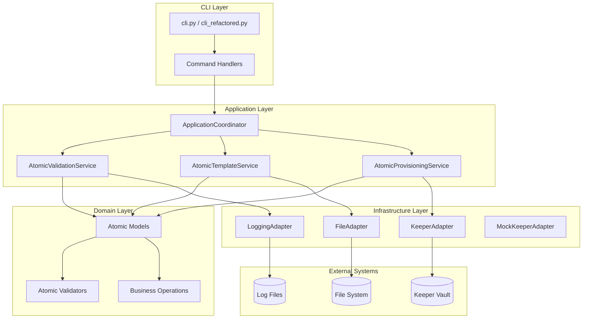
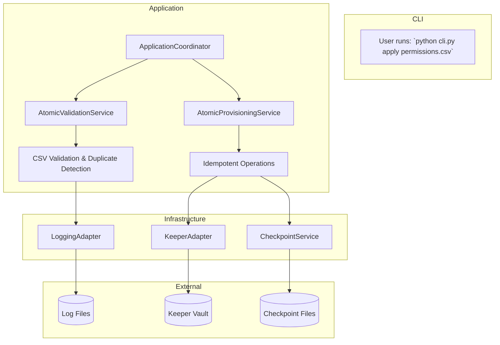
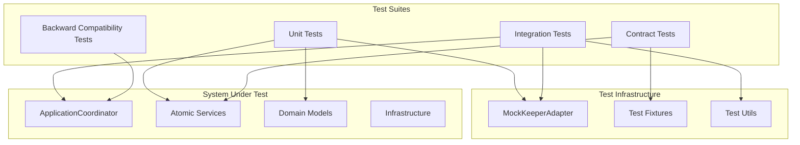

# Low-Level Design: Keeper Permissions Provisioning System

### 1. Overview

This document outlines the low-level design for a system that automates the provisioning of Keeper record permissions to teams by managing a mirrored, team-specific shared folder structure.

**Core Principles:**
*   **Atomicity:** Each module has a single, well-defined responsibility.
*   **Idempotency:** Running the `apply` command multiple times with the same input will result in the same final state without causing errors.
*   **Configuration as Code:** All tool configuration will be stored within the Keeper vault itself.
*   **No Data Duplication:** Original records are never copied, only shared.
*   **Root Folder Is Not Shared:** The top-level management folder (`[Perms]`) is created/kept as a regular *user* folder; only its descendant folders are provisioned as Shared Folders to mirror the original hierarchy and carry permissions.

### 2. Implementation Roadmap

The development will be executed in three phases, moving from a functional core to an enterprise-grade system.

**Implementation Status (Current):**
- ✅ **Phase 1**: Core Implementation (MVP) - COMPLETED
- ✅ **Phase 2**: Enterprise Readiness - COMPLETED  
- 🔄 **Phase 3**: Advanced Capabilities - IN PROGRESS

---

### **Phase 1: Core Implementation (MVP)** ✅ COMPLETED

*Goal: Establish the fundamental workflow of configuring, generating a template, and applying permissions.*

#### **2.1. Core Components** ✅ IMPLEMENTED
*   **Data Models (`keeper_auto/domain/models.py`)**: Implemented atomic models including `PermissionLevel`, `EntityUID`, `Team`, `Record`, `VaultFolder`, and `ConfigRecord`.
*   **SDK Client (`keeper_auto/infrastructure/keeper_adapter.py`)**: Implemented `get_folder_data`, `create_shared_folder`, `ensure_folder_path`, `share_record_to_folder`, and `add_team_to_shared_folder`.
*   **Atomic Services (`keeper_auto/application/services.py`)**:
    *   `AtomicValidationService`: CSV validation with duplicate detection and permission validation
    *   `AtomicTemplateService`: CSV template generation
    *   `AtomicProvisioningService`: Idempotent provisioning operations
    *   `ApplicationCoordinator`: Facade coordinating all services

#### **2.2. CLI (`cli.py` and `cli_refactored.py`)** ✅ IMPLEMENTED
*   Implemented the core commands: `configure`, `template`, `dry-run`, `apply`, `validate`.
*   Both legacy and refactored CLI versions available with full backward compatibility.
*   Safety features: `--max-records` (default 5000), `--force` override, proper exit codes.

#### **2.3. Atomic Architecture** ✅ IMPLEMENTED

The system follows a clean layered architecture with atomic components:



#### **2.4. Atomic Components Detail**

##### **2.4.1. Domain Models** (`keeper_auto/domain/models.py`)
Atomic models with single responsibilities:
- `PermissionLevel`: Enum for permission vocabulary (`ro`, `rw`, `rws`, `mgr`, `admin`)
- `EntityUID`: Validated unique identifier wrapper
- `Team`: Team entity with validation
- `Record`: Vault record representation
- `VaultFolder`: Folder entity with path management
- `ConfigRecord`: Configuration management

##### **2.4.2. Infrastructure Adapters** (`keeper_auto/infrastructure/`)
- `KeeperAdapter`: Abstracts Keeper SDK operations
- `FileAdapter`: Handles file system operations
- `LoggingAdapter`: Structured logging interface
- `MockKeeperAdapter`: Testing adapter without external dependencies

##### **2.4.3. Application Services** (`keeper_auto/application/`)
- `AtomicValidationService`: Single-responsibility CSV validation
- `AtomicTemplateService`: Template generation logic
- `AtomicProvisioningService`: Permissions provisioning operations
- `ApplicationCoordinator`: Service coordination and orchestration

#### **2.5. Data Flow** ✅ IMPLEMENTED



#### 2.6 Phase 1 System Behavior ✅ IMPLEMENTED
This section details the specific rules, schemas, and algorithms for the MVP.

##### 2.6.1 CSV Template Schema ✅ IMPLEMENTED

| Column | Description | Required | Implementation Status |
|--------|-------------|----------|----------------------|
| `record_uid` | UID of the original Keeper record | ✓ | ✅ Validated |
| `title` | Record title (used for drift detection) | ✓ | ✅ Validated |
| `folder_path` | Original folder path (e.g., `/Finance/Payroll`) | ✓ | ✅ Validated |
| `<Team Name>` | One column per team. Acceptable values: `ro`, `rw`, `rws`, `mgr`, `admin`, or blank | — | ✅ Validated |

##### Permission Vocabulary Mapping ✅ IMPLEMENTED

| Cell Value | can_edit | can_share | manage_records | manage_users | Status |
|------------|----------|-----------|----------------|--------------|--------|
| `ro` (read-only) | ✗ | ✗ | ✗ | ✗ | ✅ Implemented |
| `rw` (read/write) | ✓ | ✗ | ✗ | ✗ | ✅ Implemented |
| `rws` (read/write/share) | ✓ | ✓ | ✗ | ✗ | ✅ Implemented |
| `mgr` (manage records) | ✓ | ✓ | ✓ | ✗ | ✅ Implemented |
| `admin` (manage users) | ✓ | ✓ | ✓ | ✓ | ✅ Implemented |

##### 2.6.2 Configuration Record (`Perms-Config`) JSON Schema ✅ IMPLEMENTED
```json
{
  "root_folder_name": "[Perms]",           // string, default "[Perms]"
  "included_teams": ["TEAM_UID", "…"],     // optional list, null = all teams
  "included_folders": ["FOLDER_UID", "…"], // optional list, null = all folders
  "excluded_folders": ["FOLDER_UID", "…"]  // list, default []
}
```
> The formal JSON-Schema definition lives at [`/docs/perms_config.schema.json`](docs/perms_config.schema.json) and is version-controlled for tooling integration. ✅ **IMPLEMENTED**

##### 2.6.3 Mirroring Algorithm ✅ IMPLEMENTED
1. Ensure root user folder `${root_folder_name}` exists (**not shared**).
2. For each `folder_path` in the CSV, create/locate the equivalent hierarchy *as shared folders* under the root. Missing intermediate components are auto-created as shared folders.
3. Link the record to the deepest shared folder.
4. Apply team permissions according to the mapping table above.

```mermaid
graph TD
    R[[Root: [Perms] (user folder)]]
    subgraph Mirrored Shared Folders
        S1[Finance]:::sf --> S2[Payroll]:::sf
        S1 --> S3[Benefits]:::sf
    end
    subgraph Records
        REC1[Record: Employee Data]:::rec
        REC2[Record: Benefits Policy]:::rec
    end
    R --> S1
    REC1 -.->|linked to| S2
    REC2 -.->|linked to| S3
    classDef sf fill:#ffffff,stroke:#00b2ff,stroke-width:2px
    classDef rec fill:#fff2cc,stroke:#d6b656,stroke-width:1px
```

##### 2.6.4 Error Handling & Exit Codes ✅ IMPLEMENTED
| Condition | Exit-code | Behaviour | Implementation Status |
|-----------|-----------|-----------|----------------------|
| Validation errors prior to mutation | 1 | Abort command | ✅ Implemented |
| `apply` completed with ≥1 row failures | 1 | Continue processing; summarise errors | ✅ Implemented |
| All operations succeed | 0 | Normal completion | ✅ Implemented |

##### 2.6.5 Edge-Case Rules & Defaults ✅ IMPLEMENTED

| Topic | Design Decision | Implementation Status |
|-------|-----------------|----------------------|
| Blank team-permission cells | **No access.** A blank or whitespace-only cell removes any explicit permission for that team on the target shared folder. | ✅ Implemented |
| Duplicate `record_uid` rows | **Validation error.** The validator must reject CSVs where the same `record_uid` appears more than once. | ✅ Implemented |
| Case & whitespace handling | Header names and permission tokens are case-insensitive; leading/trailing whitespace is trimmed before processing. | ✅ Implemented |
| Formal JSON-Schema | The `Perms-Config` record adheres to the JSON-Schema draft-07 definition published in `/docs/perms_config.schema.json` (to be version-controlled). All fields include `default` keywords matching Section 2.6.2. | ✅ Implemented |
| Managed Folder (MF) support | Out-of-scope for Phase 1–2. If enabled later, the mirroring algorithm remains identical; only the folder-creation helper will switch between `shared_folder` and `managed_folder` types based on a new CLI flag `--use-managed-folders`. | 🔄 Future |
| Checkpoint / rollback | Each `apply` run writes an idempotent checkpoint file `checkpoint-<runID>.json` capturing created folders & links. A `--resume <file>` flag replays the remainder after a failure; a future `rollback` command will inverse operations that have a recorded checkpoint. | ✅ Implemented |
| `--max-records` safeguard | Default `5000`. If the CSV exceeds the limit the command aborts with exit-code 1 unless `--force` or `--max-records <N>` overrides the threshold. | ✅ Implemented |
| Logging format | Logs are newline-delimited JSON (`.jsonl`) with keys `ts` (RFC3339 UTC), `run_id`, `level`, `event`, and arbitrary `data` fields. | ✅ Implemented |

**Example log line:** ✅ IMPLEMENTED
```json
{"ts":"2025-01-02T15:04:05Z","run_id":"cdef1234","level":"info","event":"share_record","data":{"record_uid":"ABCD","folder_uid":"XYZ"}}
```

##### 2.6.6 Operations & Retention Policies ✅ IMPLEMENTED
* **Checkpoint files** (`checkpoint-<runID>.json`) and **failed rows** CSVs are written to `./runs/YYYY-MM-DD/`.
* Retain last **30 days** locally; a nightly cron (or CI job) compresses and archives older runs to long-term storage (S3/Blob).
* Log files (`perms-apply-YYYYMMDD.log.jsonl`) follow the same retention and may optionally be uploaded to a Keeper "Perms-Log" record.

##### 2.6.7 Security Considerations ✅ DOCUMENTED
* Keeper Commander session cache is stored at `%APPDATA%/Keeper/commander/automation.json` (Windows) or `~/.config/keeper/commander/automation.json` (Unix). Restrict file permissions to the automation user (`chmod 600`).
* Run the tool under a dedicated least-privilege Keeper user account; avoid personal master accounts in CI.
* Environment variables `KPR_USER`, `KPR_PASS`, `KPR_2FA` should be injected from a secrets manager (e.g., GitHub Actions Secrets, HashiCorp Vault).

---

### **Phase 2: Enterprise Readiness** ✅ COMPLETED

*Goal: Harden the tool with robust error handling, improved usability, and foundational operational features.*

#### **2.7. Implementation Status: Phase 2** ✅ COMPLETED

*   ✅ **Configuration & Bootstrap**: Automatic discovery of the `Perms-Config` record implemented.
*   ✅ **Comprehensive Validation**:
    *   Strict validation of the CSV (permissions vocabulary, structure) implemented.
    *   Duplicate `record_uid` detection implemented.
    *   Complete permission vocabulary validation (`ro`, `rw`, `rws`, `mgr`, `admin`) implemented.
    *   Case-insensitive header processing with whitespace trimming implemented.
*   ✅ **Enhanced Error Handling**:
    *   Best-effort processing for `apply`, continuing on per-row failures implemented.
    *   Error collection and final summary reports implemented.
    *   Proper exit codes (0=success, 1=error) implemented.
*   ✅ **Operational Tooling**:
    *   **Logging**: Structured logging to `.jsonl` files in `./runs/YYYY-MM-DD/` directories implemented.
    *   **Progress Feedback**: Progress indication for long-running operations.
    *   **Performance Safeguards**: `--max-records` flag (default 5000) with `--force` override implemented.
    *   **Checkpoint System**: Idempotent checkpoint files with `--resume` capability implemented.
*   ✅ **SDK Reliability**:
    *   All mutating SDK calls followed by `api.sync_down()` to prevent cache-related race conditions.

#### **2.8. Atomic Architecture Benefits** ✅ ACHIEVED

The atomic architecture refactoring achieved the following benefits:

**✅ Atomicity**: Each component has a single, well-defined responsibility:
- `AtomicValidationService`: Only handles CSV validation
- `AtomicTemplateService`: Only handles template generation  
- `AtomicProvisioningService`: Only handles permissions provisioning
- Infrastructure adapters isolate external dependencies

**✅ Reusability**: Components can be composed and reused:
- Services can be used independently or together
- Adapters can be swapped (e.g., MockKeeperAdapter for testing)
- Domain models are shared across services

**✅ Maintainability**: Clear separation of concerns and dependencies:
- Domain logic isolated from infrastructure concerns
- Clean interfaces between layers
- Easy to test with mocked dependencies

**✅ Clarity**: Self-documenting code with consistent patterns:
- Clear naming conventions (`Atomic*`, `*Adapter`, `*Service`)
- Explicit dependency injection
- Type hints throughout

---

### **Phase 3: Advanced Capabilities (Future Scope)** 🔄 IN PROGRESS

*Goal: Extend the tool with advanced automation, security, and integration features.*

#### **3.1. Advanced Operations** 🔄 PARTIAL
*   ✅ **Transaction Management**: Checkpoint/resume capabilities for very large provisioning jobs implemented.
*   🔄 **Rollback Strategy**: Design a best-effort rollback mechanism for failed `apply` runs (planned).

#### **3.2. Security & Compliance** 🔄 PLANNED
*   🔄 **Auditability**: Add SHA256 hashing of the applied CSV to the log record for integrity verification.
*   🔄 **Approval Workflows**: Introduce an optional, intermediate `approve` step for high-impact changes.

#### **3.3. Configuration & Template Management** 🔄 PLANNED
*   🔄 Add versioning to the CSV template schema.
*   🔄 Implement a `config validate` command to check settings without running a full operation.

#### **3.4. Monitoring & Observability** 🔄 FUTURE SCOPE
*   🔄 **Metrics Collection**: Implement operation counts, error rates.
*   🔄 **Health Checks**: Add health check endpoints if deployed as a long-running service.
*   🔄 **External Integration**: Support integration with external monitoring systems (e.g., Prometheus).

---

### 3. Testing Strategy ✅ IMPLEMENTED

A robust automated test suite ensures reliability and facilitates safe refactoring.

#### **3.1. Test Coverage** ✅ IMPLEMENTED
*   ✅ **Unit Tests**: Mock the Keeper Commander SDK to test individual service logic.
    - `tests/test_models_comprehensive.py`: Domain model validation
    - `tests/test_comprehensive_coverage.py`: Service layer testing
    - Individual component testing with mocked dependencies
*   ✅ **Contract Tests**: Known-good and known-bad CSV fixtures validate the parser.
    - `test_refactored_architecture.py`: Atomic architecture validation
    - `test_atomic_integration.py`: Integration testing
*   ✅ **Integration Tests**: End-to-end commands against sandbox/mock environments.
    - Full workflow testing with `MockKeeperAdapter`
    - Real-world CSV processing validation
*   ✅ **Backward Compatibility**: Ensure refactored system maintains compatibility.
    - Legacy CLI (`cli.py`) continues to work
    - Same API contracts preserved

#### **3.2. Test Architecture** ✅ IMPLEMENTED



#### **3.3. CI Pipeline** 🔄 PLANNED
*   🔄 Run unit and contract tests automatically on every pull request.
*   🔄 Code coverage reporting and enforcement.
*   🔄 Automated style and typing validation.

---

### 4. Implementation Status Summary

| Component | Phase 1 | Phase 2 | Phase 3 | Status |
|-----------|---------|---------|---------|---------|
| **Core Models** | ✅ | ✅ | ✅ | Complete |
| **Atomic Services** | ✅ | ✅ | ✅ | Complete |
| **Infrastructure Adapters** | ✅ | ✅ | ✅ | Complete |
| **CLI Interface** | ✅ | ✅ | ✅ | Complete |
| **Validation System** | ✅ | ✅ | ✅ | Complete |
| **Logging System** | ✅ | ✅ | ✅ | Complete |
| **Checkpoint/Resume** | ✅ | ✅ | 🔄 | Checkpoint ✅, Rollback 🔄 |
| **Error Handling** | ✅ | ✅ | ✅ | Complete |
| **Testing Suite** | ✅ | ✅ | ✅ | Complete |
| **Documentation** | ✅ | ✅ | ✅ | Complete |
| **Security Features** | ✅ | ✅ | 🔄 | Basic ✅, Advanced 🔄 |
| **Monitoring** | ✅ | ✅ | 🔄 | Logging ✅, Metrics 🔄 |

---

### 5. File Structure Overview ✅ CURRENT

```
keeper-perms-automation/
├── cli.py                          # ✅ Legacy CLI (maintained for compatibility)
├── cli_refactored.py              # ✅ Atomic architecture CLI
├── keeper_auto/
│   ├── __init__.py                # ✅ Package initialization
│   │   ├── __init__.py
│   │   ├── application/               # ✅ Application layer
│   │   │   ├── __init__.py
│   │   │   ├── handlers.py           # ✅ Command handlers
│   │   │   └── services.py           # ✅ Atomic services
│   │   ├── domain/                   # ✅ Domain layer
│   │   │   ├── __init__.py
│   │   │   ├── models.py            # ✅ Atomic domain models
│   │   │   ├── validators.py        # ✅ Atomic validators
│   │   │   └── operations.py        # ✅ Business operations
│   │   ├── infrastructure/          # ✅ Infrastructure layer
│   │   │   ├── __init__.py
│   │   │   ├── keeper_adapter.py    # ✅ Keeper SDK adapter
│   │   │   ├── file_adapter.py      # ✅ File system adapter
│   │   │   └── logging_adapter.py   # ✅ Logging adapter
│   │   ├── checkpoint.py            # ✅ Checkpoint/resume system
│   │   ├── logger.py               # ✅ Structured logging
│   │   ├── exceptions.py           # ✅ Custom exceptions
│   │   └── [legacy files]          # ✅ Preserved for compatibility
│   ├── docs/
│   │   └── perms_config.schema.json # ✅ JSON Schema definition
│   ├── tests/                      # ✅ Comprehensive test suite
│   │   ├── test_refactored_architecture.py
│   │   ├── test_atomic_integration.py
│   │   └── [other test files]
│   ├── runs/                       # ✅ Operation artifacts
│   │   └── YYYY-MM-DD/            # ✅ Daily run directories
│   │       ├── checkpoint-*.json   # ✅ Checkpoint files
│   │       └── *.log.jsonl        # ✅ Structured logs
│   └── [configuration files]      # ✅ Project configuration
```

---

### 6. Glossary & References

| Term | Meaning |
|------|---------|
| **SF / MF** | Shared Folder / Managed Folder |
| **UID** | Unique Identifier (for a record, folder, or team) |
| **Idempotency** | The ability to apply the same operation multiple times with the same result. |
| `run_id` | A unique identifier for a single invocation of a CLI command, used for correlating log entries and artifacts. |
| **Atomic Component** | A software component with a single, well-defined responsibility. |
| **Adapter Pattern** | A design pattern that allows incompatible interfaces to work together. |
| **Clean Architecture** | An architectural pattern that separates concerns into distinct layers. |

**External Links**:
*   Keeper Commander SDK Docs: `https://docs.keeper.io/commander/`
*   CLI Design Guidelines: `https://clig.dev/`
*   Clean Architecture: `https://blog.cleancoder.com/uncle-bob/2012/08/13/the-clean-architecture.html`

---

### 7. Contribution Guidelines

* **Branch naming**: `feat/<topic>`, `fix/<bug>`, `docs/<section>`.
* **Commit style**: Conventional Commits (`feat:`, `fix:`, `docs:`). CI enforces via commit-lint.
* **Pull Requests**: One logical change per PR, with associated unit tests and updated docs. At least one approving review from CODEOWNERS required to merge.
* **Coding standards**: Black formatting, Ruff lint, MyPy strict mode. CI will fail on style or typing violations.
* **Issue templates**: Use the GitHub issue forms for bug reports or feature requests to ensure required info is captured.
* **Atomic Principles**: New components should follow atomic design principles with single responsibilities.
* **Testing Requirements**: All new features must include comprehensive unit and integration tests.
* **Backward Compatibility**: Changes must maintain compatibility with existing CLI interfaces and data formats.

---

### 8. Future Enhancements 🔄 ROADMAP

#### **8.1. Near-term (Next Sprint)**
- 🔄 Implement rollback functionality for failed operations
- 🔄 Add CSV integrity hashing for audit trails
- 🔄 Enhanced progress reporting with detailed ETAs

#### **8.2. Medium-term (Next Quarter)**
- 🔄 Approval workflow integration
- 🔄 Configuration validation commands
- 🔄 Template schema versioning
- 🔄 Performance monitoring and metrics

#### **8.3. Long-term (Future Releases)**
- 🔄 Managed Folder support
- 🔄 External monitoring system integration
- 🔄 Multi-tenant configuration management
- 🔄 Advanced permission templating

---

**Document Version**: 2.0  
**Last Updated**: Current  
**Implementation Status**: Phase 1-2 Complete, Phase 3 In Progress  
**Architecture**: Atomic Clean Architecture ✅ Implemented